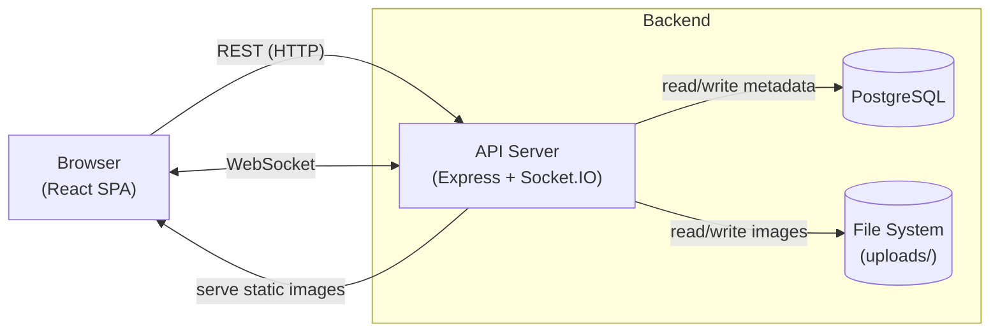

# Gram

An anonymous image-sharing app with real-time updates.

## Stack
- Express + TypeScript
- PostgreSQL
- Socket.IO
- React + Vite

## Quick Jump

- [Feature Overview](#feature-overview)
- [Architecture](#architecture)
- [Getting Started](#getting-started)
  - [With Docker](#with-docker)
  - [Without Docker](#without-docker)
- [API](#api)
- [Testing](#testing)
- [Project Structure](#project-structure)
- [Environment Variables](#environment-variables)
- [Architectural Decisions & Next Steps](#architectural-decisions--next-steps)

---

## Feature Overview

- Anonymous posts with title and tags. Up to 5 images per post
- Real-time feed updates via WebSockets
- Infinite scroll with cursor-based pagination 
- Tag-based filtering via URL params
- Image normalization at upload — EXIF auto-rotation and 2048px resize cap
- Magic-byte file validation to prevent disguised uploads (not extension-based)
- IP-based rate limiting — crucial for an anonymous application
- Structured JSON logging with per-request correlation IDs
- Dockerized deployment with multi-stage builds and Docker Compose orchestration

## Architecture



## Getting Started

### Prerequisites

- **Node.js** >= 22 
- **pnpm** >= 10
- **PostgreSQL** >= 15 (optional, via Docker)
- **Docker** + **Docker Compose** (recommended)

### With Docker (recommended)

```bash
docker compose up -d
```

This will build and start three services: the API server, the React frontend, and a PostgreSQL database.

Each service will be available on the following ports:

| Service    | URL                   |
|------------|-----------------------|
| Frontend   | [http://localhost:80](http://localhost:80)     |
| API server | [http://localhost:8080](http://localhost:8080) |
| PostgreSQL | localhost:5432        |

**Open [http://localhost:80](http://localhost:80) in your browser to access the app.**

NB: Migrations run automatically before the API starts. Image uploads are persisted to local file system using Docker bind mounts.

(Optional) To seed the database with sample posts and images, run:
```bash
docker compose exec api pnpm run db:seed
```


To stop the services, run:
```bash
docker compose down
```

### Without Docker

**1. Start PostgreSQL**:

```bash
brew services start postgresql@17
# or just the Docker database:
docker compose up db -d
```

**2. Configure environment**:

```bash
cp src/api/.env.example src/api/.env
cp src/web/.env.example src/web/.env
```

**3. Install dependencies**:

```bash
cd src/api && pnpm install
cd src/web && pnpm install
```

**4. Set up the database**:

```bash
cd src/api
pnpm run db:generate
pnpm run db:migrate
pnpm run db:seed
```

**5. Start development**:

```bash
# From repo root (runs both FE abd API in parallel)
pnpm dev

# Or individually
cd src/api && pnpm dev  
cd src/web && pnpm dev 
```

This will start the API server on [http://localhost:8080](http://localhost:8080) and the React frontend on [http://localhost:3000](http://localhost:3000).

## API

An interactive Swagger UI is available at [http://localhost:8080](http://localhost:8080). Raw spec at [`/swagger.json`](http://localhost:8080/swagger.json).

### `GET /health-check` - Health Check endpoint to verify the service is running.

**Response** `200`:
```json
{ "message": "Service is healthy" }
```

### `GET /post` — Paginated Feed

**Query Parameters:**

| Parameter | Type   | Required | Description                          |
|-----------|--------|----------|--------------------------------------|
| cursor    | string | no       | Pagination cursor from previous response |
| limit     | number | no       | Page size, 1–50 (default 20)         |
| tags      | string | no       | Comma-separated tag slugs to filter  |

**Response** `200`:
```json
{
  "data": [
    {
      "id": "uuid",
      "title": "My new post",
      "createdAt": "2025-01-15T12:00:00.000Z",
      "tags": ["viral", "funny"],
      "images": [
        { "url": "/uploads/abc123.jpg", "width": 1920, "height": 1080 }
      ]
    }
  ],
  "nextCursor": "string | null"
}
```

### `POST /post` — Create Post

Expects multipart form data (`multipart/form-data`).

**Body Fields:**

| Field  | Type   | Required | Description                                                        |
|--------|--------|----------|--------------------------------------------------------------------|
| title  | string | yes      | 1–120 characters                                                   |
| tags   | string | no       | Comma-separated (max 10 tags, each tag has a max of 24 characters) |
| images | file[] | yes      | 1–5 images, max 10 MB each. JPEG, PNG, or WebP formats accepted    |

**Response** `201`:
```json
{
  "data": {
    "id": "uuid",
    "title": "Sunset at the beach",
    "createdAt": "2025-01-15T12:00:00.000Z",
    "tags": ["nature", "travel"],
    "images": [
      { "url": "/uploads/abc123.jpg", "width": 1920, "height": 1080 }
    ]
  }
}
```

**Error responses** `400`:

| Code           | Sample message                 |
|----------------|--------------------------------|
| INVALID_INPUT  | Title is required              |
| MISSING_IMAGE  | At least one image is required |
| INVALID_UPLOAD | Unsupported file type          |
| UPLOAD_ERROR   | File too large                 |

### WebSocket

The Frontend connects via Socket.IO at [http://localhost:8080/socket.io](http://localhost:8080/socket.io). The server emits a `post.created` event with the post object on every new upload. The Frontend listens for this event and updates the feed in real time.

## Testing

```bash
cd src/api && pnpm test # API tests
cd src/web && pnpm test # Frontend tests
```

## Project Structure

```
src/api/     # Express API (standalone pnpm project)
src/web/     # React SPA (standalone pnpm project)
```

Each project (API and Web) has its own `package.json` and `pnpm-lock.yaml`. They communicate only over HTTP and WebSockets.

## Environment Variables

See `src/api/.env.example` and `src/web/.env.example` for all available variables with defaults.

## Architectural Decisions & Next Steps

For a deeper dive into the system design, technology choices, and planned improvements, see [architecture.md](./architecture.md).
